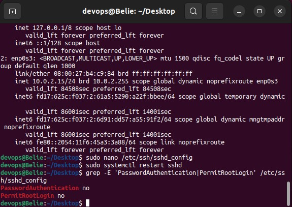
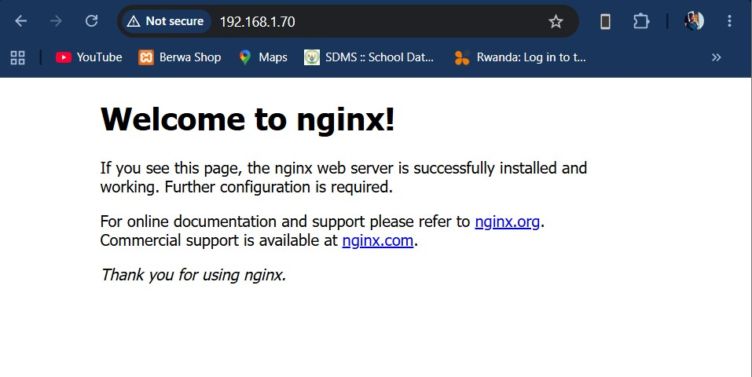

# Lab 1 - Linux & Git Foundations

## What is project does

Automates setup of a fresh Ubuntu 22.04 server for the university IT club website.
After running the script the server has NGINX, UFW, Git, and Curl installed,
with ports 22, 80, and 443 open.

## Files- provision.sh — installs and configures

everything on the server.- deploy.sh — copies and runs provision.sh on a remote VM over SSH.

## How to run

# Directly on the VM:
chmod +x provision.sh && sudo ./provision.sh

# From your laptop against a remote VM:

chmod +x deploy.sh && ./deploy.sh devops@196.168.0.70
## Verify

Open http://196.168.1.70 in a browser — you should see the NGINX welcome page.

## Repository

https://github.com/NKBelie/27174_Belie_NDAYISABA_KAMARIZA_GrpA

## Screenshots- screenshots/checkpoint1.png — sshd_config settings (Checkpoint 1)

## screenshots/checkpoint2.png — NGINX welcome page (Checkpoint 2)

## Pre-Lab Answers

Q1. Difference between sudo su and su -

sudo su switches to the root user using your current user’s sudo privileges, without fully loading root’s environment. It keeps most of your current user’s environment variables.

su - switches to the root user and loads the full root environment, including root’s PATH, home directory, and shell settings. It requires the root password instead of sudo privileges.

Q2. Why do we use SSH keys instead of passwords for remote login?

SSH keys are more secure because they use cryptographic key pairs instead of passwords that can be guessed or brute-forced. The private key stays on the user’s machine and is never sent over the network, making interception nearly impossible. They also allow stronger authentication and easier automation.

Q3. What does chmod 600 ~/.ssh/authorized_keys do and why is it required?

chmod 600 sets file permissions so that only the owner can read and write the file, while all other users have no access.

SSH requires this because if other users can read or modify authorized_keys, they could add or steal authorized access, which would be a serious security risk.

## Post-Lab Questions Answers

PQ1. Why is unattended apt upgrade -y risky in production?

Unattended upgrades can break running services because updates may introduce incompatible changes or restart critical services unexpectedly. This can cause downtime or system instability. In real organizations, upgrades are handled using staged environments (dev → staging → production), scheduled maintenance windows, and controlled package versioning to ensure stability before deployment.

PQ2. What happens if you skip the UFW firewall step?

If UFW is not enabled, all ports may remain open to the internet, making the server vulnerable to attacks.

Leaving port 22 open exposes SSH to brute-force login attempts. This is dangerous because attackers can continuously try passwords or exploit weak configurations.

Ways to reduce risk:

Use SSH key authentication only (disable passwords)
Change default SSH port (22 → custom port)
Restrict access by IP address
Use fail2ban to block repeated failed login attempts

PQ3. Why is storing infrastructure setup in Git better than manual commands?

Using Git ensures reproducibility because the same script can be executed multiple times to produce identical environments. It also improves teamwork since multiple developers can review, modify, and track changes collaboratively. Additionally, Git provides an audit trail, making it easy to see who changed what and when, which is essential for debugging and compliance in real systems.
